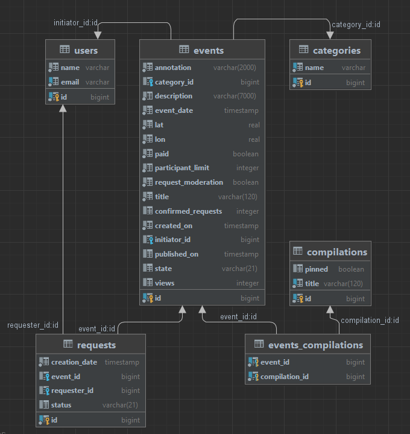

# **java-explore-with-me**
_____________________
Template repository for ExploreWithMe project. 
[Go to GitHub](https://github.com/SergeyBabkin86/java-explore-with-me/pull/1)

## Описание
Приложение — это афиша, где можно предложить какое-либо событие от выставки до похода в кино и набрать компанию для участия в нём.

Приложение выполнено на основе микросервисной архитектуры. Для запуска приложения необходимо запустить команду docker-compose up.

Сервисы доступны по адресам:
- **основной сервис (ewm-main)**: ```localhost:8080```
  _Основной сервис — содержит всё необходимое для работы продукта._
- **сервер статистики (ewm-stat)**: ```localhost:9090```
  _Сервис статистики — хранит количество просмотров и позволяет делать различные выборки для анализа работы приложения._

Базы данных: 
- основной сервис: ```jdbc:postgresql://ewm-db:5432/explore-with-me```
  #### ewm-main database diagram:


- сервера статистики: ```jdbc:postgresql://stats-db:5432/ewm-stat```
  #### ewm-stat database diagram:


## Основной сервис
API основного сервиса разделен на три части:

- Публичная - доступна без регистрации любому пользователю сети.
- Закрытая - доступна только авторизованным пользователям.
- Административная - для администраторов сервиса.
